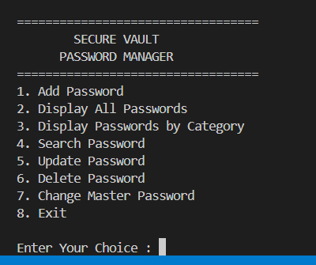

# 🔐 SecureVault - Password Manager in C

A simple **console-based Password Manager** developed in **C Programming**. The project securely stores website credentials using **binary file handling** and protects access through a **Master Password Authentication System**.

This project was developed as a **C Programming Fundamentals Mini Project** to demonstrate the use of structures, functions, file handling, arrays, conditional statements, and modular programming.

---

# Project Information

| Field | Details |
|-------|---------|
| **Project Title** | SecureVault - Password Manager in C |
| **Project Type** | Console-Based Application |
| **Programming Language** | C |
| **Development Environment** | Visual Studio Code / GCC |
| **Version Control** | Git & GitHub |
| **Difficulty Level** | Beginner |

---

# Problem Statement

Managing passwords manually in notebooks or text files is insecure and inconvenient. Users often forget passwords or store them in unsafe locations.

This project provides a simple console-based password manager that securely stores credentials in binary files and protects access using a Master Password.

---

# Objectives

- Create a Master Password for secure login.
- Authenticate users before accessing stored passwords.
- Add new password records.
- Display all saved passwords.
- Display passwords category-wise.
- Search saved passwords.
- Update existing passwords.
- Delete password records.
- Store records permanently using binary file handling.

---

# Features

- 🔑 Master Password Authentication
- ➕ Add Password
- 📋 Display All Passwords
- 📂 Display Passwords by Category
- 🔍 Search Password
- ✏️ Update Password
- 🗑 Delete Password
- 🔒 Change Master Password
- 💾 Binary File Storage
- 📁 Modular Program Structure



---

# Technologies Used

- C Programming
- Structures
- Functions
- Arrays
- File Handling
- Binary Files
- Conditional Statements
- Loops
- Switch Case
- String Handling

---

# Project Structure

```text
.
│
├── SourceCode/
│   ├── main.c
│   ├── password.c
│   ├── password.h
│   ├── master_password.c
│   └── master_password.h
│
├── Data/
│   ├── master.dat
│   └── vault.dat
│
├── Output/
│   └── Screenshots
│
├── Report/
│   └── Project_Report.pdf
│
├── PPT/
│   └── Presentation.pptx
│
├── README.md
└── LICENSE
```

---

# Password Record Structure

```c
typedef struct
{
    char website[50];
    char username[50];
    char password[50];
    char category[20];

} Password;
```

---

# Program Modules

## Master Password Module

- Create Master Password
- User Authentication
- Change Master Password

---

## Password Management Module

- Add Password
- Display All Passwords
- Display Passwords by Category
- Search Password
- Update Password
- Delete Password

---

# Categories

Passwords can be stored under the following categories:

- Social
- Email
- Banking
- Shopping
- Work
- Entertainment
- Others

---

# File Handling

The project uses binary file handling.

| File | Purpose |
|------|----------|
| master.dat | Stores the Master Password |
| vault.dat | Stores Password Records |

Functions Used:

- fopen()
- fclose()
- fread()
- fwrite()
- remove()
- rename()

---

# How to Run

## Step 1

Open terminal.

Navigate to SourceCode folder.

```bash
cd SourceCode
```

---

## Step 2

Compile

```bash
gcc main.c password.c master_password.c -o SecureVault
```

---

## Step 3

Run

Windows

```bash
.\SecureVault.exe
```

Linux

```bash
./SecureVault
```

---

# Program Workflow

```
Start Program
      │
      ▼
Check master.dat
      │
      ├── Not Found
      │      │
      │      ▼
      │ Create Master Password
      │
      ▼
Authenticate User
      │
      ▼
Main Menu
      │
      ├── Add Password
      ├── Display Passwords
      ├── Search Password
      ├── Update Password
      ├── Delete Password
      ├── Change Master Password
      └── Exit
```

---

# Output Screenshots

Screenshots are available in:

```
Output/
```

Included Screenshots:

- Create Master Password
- Change Master Password
- Add Password
- Display All Passwords
- Display Passwords by Category
- Search by Website
- Search by Username
- Search by Category
- Update Password
- Delete Password
- Exit Program

---

# C Programming Concepts Used

- Variables
- Arrays
- Structures
- Functions
- Header Files
- Loops
- Switch Case
- Conditional Statements
- String Functions
- Binary File Handling

---

# Advantages

- Easy to use
- Beginner-friendly
- Modular design
- Permanent data storage
- Secure login using Master Password
- Simple console interface

---

# Limitations

- Passwords are stored in plain text.
- No encryption.
- No password generation feature.
- No password recovery option.
- Console-based interface only.

---

# Future Enhancements

- Password Encryption
- Password Generator
- Password Strength Checker
- Hide Password While Typing
- Export Passwords
- Backup & Restore
- GUI Version
- Multiple User Accounts

---

# Learning Outcomes

This project helped in understanding:

- Modular Programming
- Structures in C
- File Handling
- Binary Files
- Functions
- Menu Driven Programs
- Git & GitHub
- Project Documentation


## Default Master Password

For demonstration purposes, a sample `master.dat` file is included in this repository.

**Default Master Password:** `Xyz@4321`

> If you delete `Data/master.dat`, the program will prompt you to create a new Master Password on the next run.

## Sample Data

This repository includes sample password records in `Data/vault.dat` for demonstration purposes.

You may delete `vault.dat` to start with an empty password vault.

---

# Author

**✒️ AADARSH JHA**

---

# License

This project is licensed under the MIT License.

---